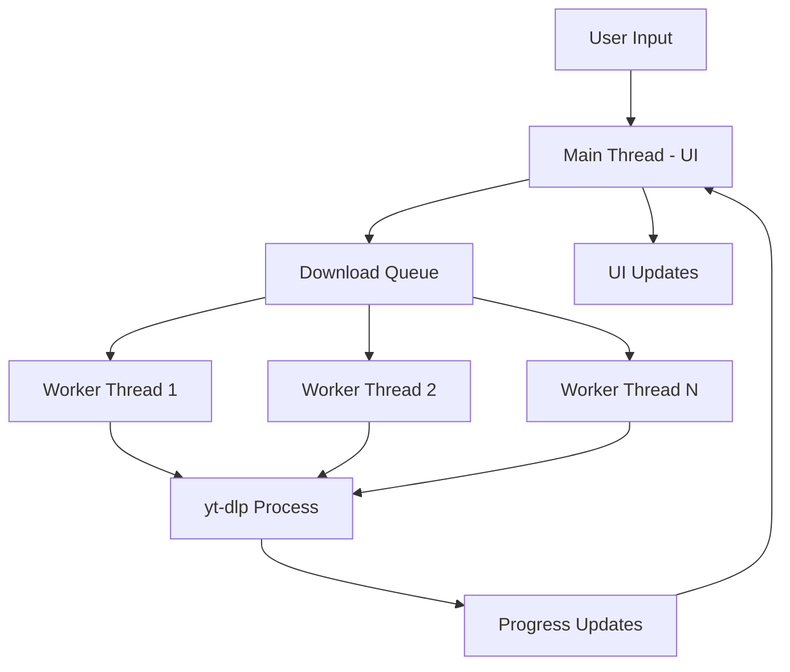

# Modern-YTDLP-GUI

A multi-threaded desktop GUI for `yt-dlp` with a modern dark theme and non-blocking I/O.

## Problem Statement

Downloading videos from YouTube and other platforms via command-line `yt-dlp` is powerful but not user-friendly. Existing GUIs often freeze during downloads, lack modern UI/UX, or require complex setup. This project provides a responsive, threaded desktop application with a custom dark-themed UI engine.

## Architecture



### Key Components

| Component | Responsibility |
|-----------|----------------|
| **Main Thread** | UI rendering, event handling, queue management |
| **Worker Pool** | Threaded `yt-dlp` subprocess execution |
| **Queue Manager** | Priority-based download scheduling |
| **Progress Bridge** | Thread-safe progress/status communication |
| **Custom UI Engine** | Dark-themed widgets, responsive layout |

## Build & Run

### Prerequisites

- Python 3.8+
- `yt-dlp` (`pip install yt-dlp`)
- `ffmpeg` (for video merging)
- `tkinter` (usually included with Python)

### Installation

```bash
# Clone repository
git clone https://github.com/HitroBro/Modern-YTDLP-GUI.git
cd Modern-YTDLP-GUI

# Install dependencies
pip install -r requirements.txt

# Run
python main.py
```

### Development

```bash
# Run with auto-reload (if using watchdog)
python main.py --dev

# Run tests
python -m pytest tests/
```

## Features

- **Multi-threaded Downloads** — Concurrent downloads without UI freezing
- **Modern Dark UI** — Custom themed widgets, responsive layout
- **Format Selection** — Video/audio quality, container format
- **Playlist Support** — Batch download with progress tracking
- **Embedded ffmpeg** — Automatic video/audio merging
- **Progress Tracking** — Real-time speed, ETA, progress bars
- **History** — Download history with retry capability

## Screenshots

*Coming soon — add screenshots of the main window, download progress, and settings dialog*

## Configuration

Settings are stored in `config.json`:

```json
{
  "download_dir": "~/Downloads",
  "max_concurrent": 3,
  "default_format": "bestvideo+bestaudio",
  "theme": "dark"
}
```

## Roadmap

- [ ] YouTube authentication for private videos
- [ ] SponsorBlock integration
- [ ] Download scheduling
- [ ] System tray minimization
- [ ] Multi-language support

## License

MIT License — See [LICENSE](LICENSE) for details.

## Related Projects

- [async-tcp-gateway](https://github.com/HitroBro/async-tcp-gateway) — High-performance C networking
- [NeoShare-Local-Cloud](https://github.com/HitroBro/NeoShare-Local-Cloud) — Zero-dependency HTTP server
- [HitroBro.github.io](https://github.com/HitroBro/HitroBro.github.io) — Technical portfolio with interactive demos